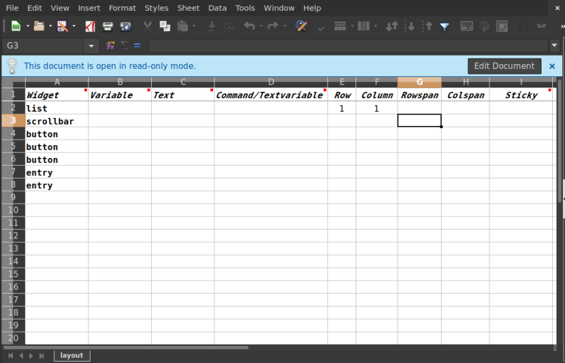
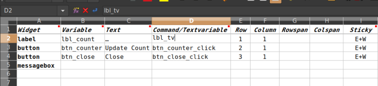
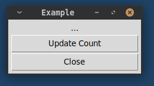

# tkauto
Generate tkinter/python script from Excel spreadsheet
# tkauto.py

Tkauto.py is a python 3.# script.  

Tkauto inputs an xlsx (excel) file and builds a starter script  
for a Python GUI desktop application. The Python script uses  
tkinter for the GUI API.

## List Widgets With Options



`layout_tpl.xlsx' is a spreadsheet used to indicate which widgets  
your application will use, where they'll be located, and some of  
their essential options. But first, Save-As to a different name.

Some columns are commented to further define their purpose.



Here's a little more already filled in.

There is a bare minimum of options provided in the spreadsheet.  
However, there are enough options to generate a script that will run with just minor editing.
The object here is to eliminate much of the initial editing when starting a new application.  

## Generate the script

```
usage:

$>python3 tkauto.py layout.xlsx

```
Using the above example, the Excel file was named `layout.xlsx`.  

Tkauto uses a template file called `tkauto_tpl.py` in addition to the xlsx file.  

`tkauto.py` produces an output script called `output.py`.  

The output.py file is what you rename and start editing to finish the application.  

Usually you will not run `tkauto.py` more than one time. If you forgot some widgets
or options usually you can just edit them in.

**_BE CAREFUL_**  
RUNNING TKAUTO.PY A SECOND TIME WILL WIPE OUT ANY EDITS YOU MADE.  

---

The output for this example is shown below with some minor editing to the event handlers.



```
# output.py
# This was created by tkauto.py, layout.xlsx and tkauto_tpl.py

from tkinter import *
from tkinter import font
# import requests, sys, os, csv, webbrowser
# from tkinter.filedialog import askopenfilename
from tkinter import messagebox

class Application(Frame):
    def __init__(self, parent):
        Frame.__init__(self, parent)
        self.pack(fill=BOTH, expand=True, padx=4, pady=4)
        self.create_widgets()

    count = 0

    def create_widgets(self):
        ''' creates GUI for app '''
        self.lbl_count = Label(self, text='…')
        self.lbl_count.grid(row=1, column=1 , sticky=E+W)

        btn_counter = Button(self, text='Update Count', command=self.btn_counter_click)
        btn_counter.grid(row=2, column=1 , sticky=E+W)

        btn_close = Button(self, text='Close', command=self.btn_close_click)
        btn_close.grid(row=3, column=1 , sticky=E+W)


# from tkinter import messagebox
# messagebox.showerror("Error", "Error message")
# messagebox.showwarning("Warning","Warning message")
# messagebox.showinfo("Information","Informative message")


        # expand widget to fill the grid
        self.columnconfigure(1, weight=1, pad=100)
        # self.rowconfigure(1, weight=1, pad=20)

    def btn_counter_click(self):
        self.count += 1
        self.lbl_count['text'] = str(self.count)

    def btn_close_click(self):
        response = messagebox.askokcancel('Close App', 'Click OK to Close')
        if response:
            root.destroy()
#

# def save_location():
#     ''' executes at WM_DELETE_WINDOW event '''
#     with open("winfoxy", "w") as fout:
#         fout.write(str(root.winfo_x()) + "\n" + str(root.winfo_y() - 24))
#     root.destroy()

root = Tk()

# root.geometry("200x120") # WxH+left+top
# or the following:
''' the following repositions the window from last time '''
# if os.path.isfile("winfoxy"):
#     lcoor = tuple(open("winfoxy", 'r'))  # no relative path for this
#     root.geometry('350x200+%d+%d'%(int(lcoor[0].strip()),int(lcoor[1].strip())))
# else:
#     root.geometry("350x200") # WxH+left+top

root.title("Example")
# root.configure(background='#666')
# root.overrideredirect(True) # removed window decorations
# root.resizable(0,0) # no resize & removes maximize button
# root.protocol("WM_DELETE_WINDOW", save_location)
app = Application(root)
app.mainloop()
```

---
ML July 2020

